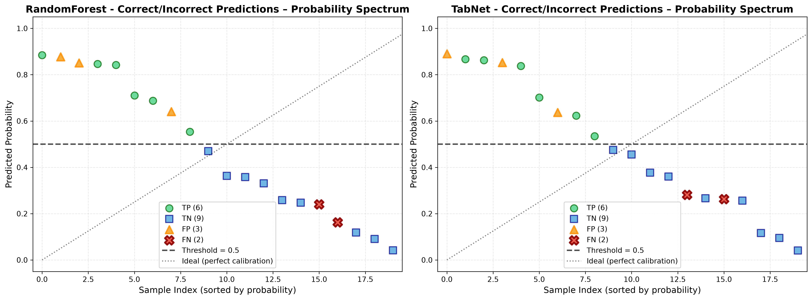

# Test Prediction Verification Report

**Ngày tạo:** 2025-11-07

Báo cáo này so sánh dự báo của models với ground truth trên tập test.

---

## 1. Summary Statistics

### RandomForest

- **Total samples:** 20
- **Correct predictions:** 15 (75.0%)
- **Accuracy:** 0.7500
- **Precision:** 0.6667
- **Recall:** 0.7500
- **F1:** 0.7059

### TabNet

- **Total samples:** 20
- **Correct predictions:** 15 (75.0%)
- **Accuracy:** 0.7500
- **Precision:** 0.6667
- **Recall:** 0.7500
- **F1:** 0.7059

## 2. Detailed Predictions - RandomForest

| Sample ID | y_true | y_pred_prob | y_pred_binary | Correct |
|-----------|--------|-------------|---------------|----------|
| 2900 | 1 | 0.8846 | 1 | [OK] |
| 11830 | 0 | 0.8772 | 1 | [X] |
| 10739 | 0 | 0.8510 | 1 | [X] |
| 5282 | 1 | 0.8461 | 1 | [OK] |
| 13420 | 1 | 0.8423 | 1 | [OK] |
| 5733 | 1 | 0.7102 | 1 | [OK] |
| 4649 | 1 | 0.6875 | 1 | [OK] |
| 7310 | 0 | 0.6408 | 1 | [X] |
| 5538 | 1 | 0.5532 | 1 | [OK] |
| 8231 | 0 | 0.4704 | 0 | [OK] |
| 2791 | 0 | 0.3629 | 0 | [OK] |
| 4045 | 0 | 0.3579 | 0 | [OK] |
| 3143 | 0 | 0.3311 | 0 | [OK] |
| 13405 | 0 | 0.2583 | 0 | [OK] |
| 10175 | 0 | 0.2477 | 0 | [OK] |
| 7653 | 1 | 0.2400 | 0 | [X] |
| 8045 | 1 | 0.1626 | 0 | [X] |
| 169 | 0 | 0.1182 | 0 | [OK] |
| 8610 | 0 | 0.0910 | 0 | [OK] |
| 3855 | 0 | 0.0415 | 0 | [OK] |

## 3. Detailed Predictions - TabNet

| Sample ID | y_true | y_pred_prob | y_pred_binary | Correct |
|-----------|--------|-------------|---------------|----------|
| 10739 | 0 | 0.8907 | 1 | [X] |
| 2900 | 1 | 0.8670 | 1 | [OK] |
| 13420 | 1 | 0.8628 | 1 | [OK] |
| 11830 | 0 | 0.8526 | 1 | [X] |
| 5282 | 1 | 0.8379 | 1 | [OK] |
| 5733 | 1 | 0.7017 | 1 | [OK] |
| 7310 | 0 | 0.6368 | 1 | [X] |
| 4649 | 1 | 0.6231 | 1 | [OK] |
| 5538 | 1 | 0.5345 | 1 | [OK] |
| 8231 | 0 | 0.4748 | 0 | [OK] |
| 3143 | 0 | 0.4553 | 0 | [OK] |
| 4045 | 0 | 0.3767 | 0 | [OK] |
| 2791 | 0 | 0.3603 | 0 | [OK] |
| 7653 | 1 | 0.2808 | 0 | [X] |
| 13405 | 0 | 0.2663 | 0 | [OK] |
| 8045 | 1 | 0.2626 | 0 | [X] |
| 10175 | 0 | 0.2560 | 0 | [OK] |
| 169 | 0 | 0.1161 | 0 | [OK] |
| 8610 | 0 | 0.0953 | 0 | [OK] |
| 3855 | 0 | 0.0412 | 0 | [OK] |

## 4. Feature Values (Top 10 Samples by Prediction Probability)

### RandomForest

| Sample ID | gender | height | weight | ap_hi | ap_lo | cholesterol | gluc | smoke | alco | active | y_true | y_pred_prob |
|---|---|---|---|---|---|---|---|---|---|---|---|---|
| 2900 | 1.00 | 158.00 | 58.00 | 150.00 | 90.00 | 1.00 | 1.00 | 0.00 | 0.00 | 1.00 | 1 | 0.8846 |
| 11830 | 1.00 | 164.00 | 117.00 | 170.00 | 100.00 | 1.00 | 1.00 | 0.00 | 0.00 | 1.00 | 0 | 0.8772 |
| 10739 | 1.00 | 140.00 | 78.00 | 170.00 | 90.00 | 1.00 | 1.00 | 0.00 | 0.00 | 0.00 | 0 | 0.8510 |
| 5282 | 1.00 | 169.00 | 75.00 | 140.00 | 90.00 | 1.00 | 1.00 | 0.00 | 0.00 | 0.00 | 1 | 0.8461 |
| 13420 | 2.00 | 172.00 | 78.00 | 150.00 | 100.00 | 1.00 | 1.00 | 0.00 | 0.00 | 1.00 | 1 | 0.8423 |
| 5733 | 2.00 | 164.00 | 72.00 | 130.00 | 90.00 | 2.00 | 1.00 | 0.00 | 0.00 | 0.00 | 1 | 0.7102 |
| 4649 | 1.00 | 159.00 | 65.00 | 130.00 | 90.00 | 1.00 | 1.00 | 0.00 | 0.00 | 1.00 | 1 | 0.6875 |
| 7310 | 1.00 | 159.00 | 58.00 | 120.00 | 80.00 | 1.00 | 1.00 | 0.00 | 0.00 | 0.00 | 0 | 0.6408 |
| 5538 | 1.00 | 163.00 | 85.00 | 130.00 | 80.00 | 1.00 | 1.00 | 0.00 | 0.00 | 1.00 | 1 | 0.5532 |
| 8231 | 1.00 | 150.00 | 70.00 | 100.00 | 70.00 | 2.00 | 1.00 | 0.00 | 0.00 | 1.00 | 0 | 0.4704 |

### TabNet

| Sample ID | gender | height | weight | ap_hi | ap_lo | cholesterol | gluc | smoke | alco | active | y_true | y_pred_prob |
|---|---|---|---|---|---|---|---|---|---|---|---|---|
| 10739 | 1.00 | 140.00 | 78.00 | 170.00 | 90.00 | 1.00 | 1.00 | 0.00 | 0.00 | 0.00 | 0 | 0.8907 |
| 2900 | 1.00 | 158.00 | 58.00 | 150.00 | 90.00 | 1.00 | 1.00 | 0.00 | 0.00 | 1.00 | 1 | 0.8670 |
| 13420 | 2.00 | 172.00 | 78.00 | 150.00 | 100.00 | 1.00 | 1.00 | 0.00 | 0.00 | 1.00 | 1 | 0.8628 |
| 11830 | 1.00 | 164.00 | 117.00 | 170.00 | 100.00 | 1.00 | 1.00 | 0.00 | 0.00 | 1.00 | 0 | 0.8526 |
| 5282 | 1.00 | 169.00 | 75.00 | 140.00 | 90.00 | 1.00 | 1.00 | 0.00 | 0.00 | 0.00 | 1 | 0.8379 |
| 5733 | 2.00 | 164.00 | 72.00 | 130.00 | 90.00 | 2.00 | 1.00 | 0.00 | 0.00 | 0.00 | 1 | 0.7017 |
| 7310 | 1.00 | 159.00 | 58.00 | 120.00 | 80.00 | 1.00 | 1.00 | 0.00 | 0.00 | 0.00 | 0 | 0.6368 |
| 4649 | 1.00 | 159.00 | 65.00 | 130.00 | 90.00 | 1.00 | 1.00 | 0.00 | 0.00 | 1.00 | 1 | 0.6231 |
| 5538 | 1.00 | 163.00 | 85.00 | 130.00 | 80.00 | 1.00 | 1.00 | 0.00 | 0.00 | 1.00 | 1 | 0.5345 |
| 8231 | 1.00 | 150.00 | 70.00 | 100.00 | 70.00 | 2.00 | 1.00 | 0.00 | 0.00 | 1.00 | 0 | 0.4748 |

## 5. Analysis

### Correct Predictions

- **RF:** 15/20 (75.0%)
- **TabNet:** 15/20 (75.0%)

### Incorrect Predictions (False Positives & False Negatives)

- **RF False Positives:** 3
- **RF False Negatives:** 2
- **TabNet False Positives:** 3
- **TabNet False Negatives:** 2

## 6. Probability Spectrum Visualization

*Hình 6.1: Biểu đồ phân phối probability cho các nhóm dự đoán. TP (True Positive), TN (True Negative), FP (False Positive), FN (False Negative - sai nghiêm trọng). Đường đứt nét đen: Threshold = 0.5. Đường chấm chấm: Ideal calibration line.*

## 7. Correct Predictions - Detailed Tables

### 7.1. True Positives (Correctly Predicted Disease) - RandomForest

| Sample ID | y_true | RF Prob | TabNet Prob | Key Features | Lifestyle |
|-----------|--------|---------|-------------|--------------|----------|
| 2900 | 1 | 0.8846 | 0.8670 | N/A | N/A |
| 5282 | 1 | 0.8461 | 0.8379 | N/A | N/A |
| 13420 | 1 | 0.8423 | 0.8628 | N/A | N/A |
| 5733 | 1 | 0.7102 | 0.7017 | N/A | N/A |
| 4649 | 1 | 0.6875 | 0.6231 | N/A | N/A |
| 5538 | 1 | 0.5532 | 0.5345 | N/A | N/A |

### 7.2. True Negatives (Correctly Predicted No Disease) - RandomForest

| Sample ID | y_true | RF Prob | TabNet Prob | Key Features | Lifestyle |
|-----------|--------|---------|-------------|--------------|----------|
| 8231 | 0 | 0.4704 | 0.4748 | N/A | N/A |
| 2791 | 0 | 0.3629 | 0.3603 | ap_hi=140, ap_lo=90, age=57, BMI=35.1, chol=1, bp_stage=3 | smoke=1, alco=0, active=1, risk=0.5 |
| 4045 | 0 | 0.3579 | 0.3767 | N/A | N/A |
| 3143 | 0 | 0.3311 | 0.4553 | N/A | N/A |
| 13405 | 0 | 0.2583 | 0.2663 | N/A | N/A |
| 10175 | 0 | 0.2477 | 0.2560 | N/A | N/A |
| 169 | 0 | 0.1182 | 0.1161 | N/A | N/A |
| 8610 | 0 | 0.0910 | 0.0953 | ap_hi=140, ap_lo=90, age=54, BMI=31.1, chol=1, bp_stage=3 | smoke=0, alco=0, active=1, risk=-0.5 |
| 3855 | 0 | 0.0415 | 0.0412 | N/A | N/A |

## 8. Incorrect Predictions - Detailed Tables

### 8.1. False Positives (Predicted: 1, Actual: 0) - RandomForest

| Sample ID | y_true | RF Prob | TabNet Prob | Key Features | Lifestyle |
|-----------|--------|---------|-------------|--------------|----------|
| 11830 | 0 | 0.8772 | 0.8526 | N/A | N/A |
| 10739 | 0 | 0.8510 | 0.8907 | ap_hi=130, ap_lo=90, age=57, BMI=19.8, chol=2 | smoke=0, alco=0, active=1, risk=-0.5 |
| 7310 | 0 | 0.6408 | 0.6368 | N/A | N/A |

### 8.2. False Negatives (Predicted: 0, Actual: 1) - RandomForest

| Sample ID | y_true | RF Prob | TabNet Prob | Key Features | Lifestyle |
|-----------|--------|---------|-------------|--------------|----------|
| 7653 | 1 | 0.2400 | 0.2808 | N/A | N/A |
| 8045 | 1 | 0.1626 | 0.2626 | N/A | N/A |

---

**Báo cáo được tạo tự động từ test predictions.**
